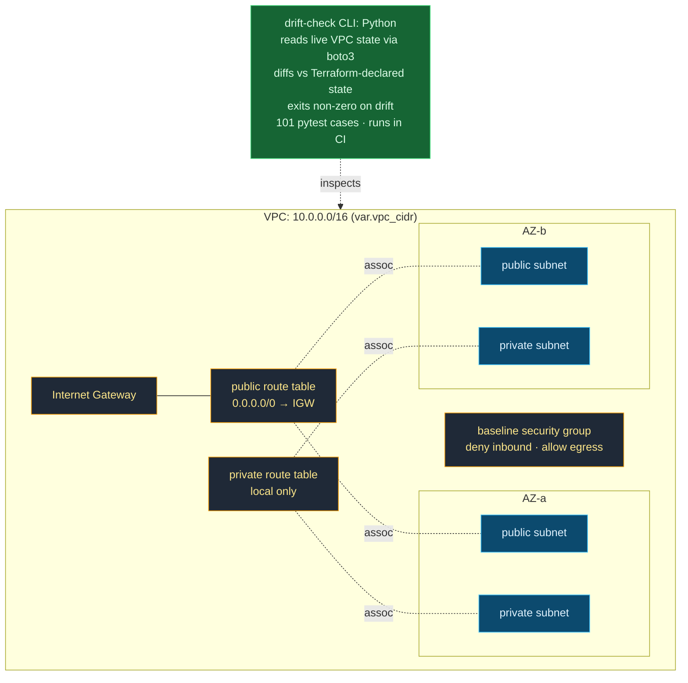

# `network` Module + Drift Check

The reusable `network` module (VPC, public/private subnets across AZs, IGW,
routing, baseline SG) and the Python drift-check CLI that verifies live
state matches the Terraform declaration.

**OpenTofu / Terraform · consumed by `environments/dev` · no cloud
resources applied.** Subnet count is driven by the `azs` /
`public_subnet_cidrs` / `private_subnet_cidrs` variables, two AZs shown
here is the `dev` default, not a module limit.
